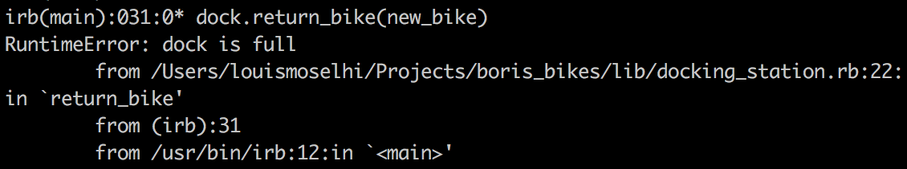
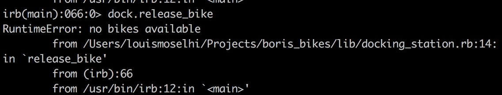
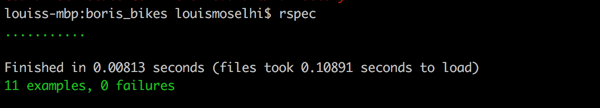

# Boris Bikes

This is a command line app I built during my first week of programming at Makers Academy. It is an app which simulates using London's [Boris Bikes](https://tfl.gov.uk/modes/cycling/santander-cycles), now called Santander Cycles.

## Domain Model

| Objects        | Messages           |
| -------------   |-------------|
| Bike            |working?, break!|
| Docking_station | release_bike, return_bike |

## Setup

Clone this repository and cd into it in your Terminal.

[Install irb](https://www.preparetocode.io/mac/essential/pry.html) if you don't have it already and run it with:

```
$ irb
```

There are some files we need to require:

```
> require "./lib/docking_station.rb"
> require "./lib/bike.rb"
```
## Usage

Now you can create a new bike and dock:

```
> new_bike = Bike.new
> dock = DockingStation.new
```
You can return your new bike back to the dock 😔:

```
> dock.return_bike(new_bike)
```
And release it to take it for a spin 😎:
```
> dock.release_bike
```
The dock has a capacity of 20 bikes, so if you try and add 21 you get an error:



And when you try and take a bike from an empty dock you also get an error:



## Testing

Testing is done with [RSpec](http://rspec.info/). To install it run in Terminal:

```
gem install RSpec
```
If you are getting errors installing gems you may have to add the ruby directory to your PATH first:

```
PATH="`ruby -e 'puts Gem.user_dir'`/bin:$PATH"
```

Then you can run the tests (located in spec folder):

```
$ rspec
```


## My Approach

I wanted to tackle this project from a OOP standpoint, making sure I set out the domain model first to get an overview of the objects and how they were to interact. As this was my first project I also wanted to make sure it was fully test-driven, so I also looked into how to write RSpec tests at an early stage, before writing any code. A developer is a 'knowledge worker' - someone who will spend the majority of their time researching and learning how to solve problems.

## User Stories
```
As a person,
So that I can use a bike,
I'd like a docking station to release a bike.

As a person,
So that I can end my biking journey,
I'd like to put the bike back into the docking station.
```
